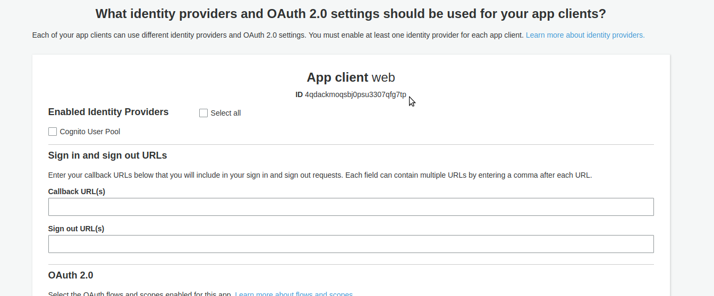

I present this not as "the right way," but merely the way I did it.

# Foreward

I set out to build a serverless application that would facilitate a game inspired by the Effectively Wild podcast's [episode #1315](https://blogs.fangraphs.com/effectively-wild-episode-1315-the-2019-minor-league-free-agent-draft/).

I envisioned a site where users could choose to login via facebook or via an email address and password. Also, there would be a leaderboard that would be visible to users who were not logged in.

This was a fun excuse for me to further my studies in the following technologies:

- ReactJS
- Aws Amplify
- Aws AppSync
- Aws Cloudfront
- Aws Cognito

# To launch this project

I may try to squeeze all of the AWS stuff into a Cloudformation Template at some point. But for now, here are the instructions.

## Code

- `git clone https://github.com/murribu/milb-freeagent-draft`
- `yarn`
- `cp src/config.example.js src/config.js`

## Facebook App

- Follow the instructions found [here](https://serverless-stack.com/chapters/facebook-login-with-cognito-using-aws-amplify.html) to create your facebook app.
- Copy your facebookID into your `src/config.js` file
- You can also use that same blog post to guide you through setting up your Cognito Federated Identity Pool (but stop reading when it tells you to edit your code)
- Copy your Identity Pool ID into your `src/config.js` file

## Cognito

- Go to [Cognito](https://console.aws.amazon.com/cognito/home?region=us-east-1#)
- Create a new User Pool

  - Click on "Manage User Pools"
  - Click "Create User Pool"
  - Give your pool a name
  - Click "Review Defaults"
  - Click "Attributes" on the left to change its settings
    - Select "Email address or phone number" instead of "Username"
    - Click "Next Step" (this is what actually saves those changes)
  - In the "Policies" section, I unselected all of the password requirements. But that's up to you.
  - Click on "App clients"
    - Click on "Add an app client"
    - Give your new app client a name. I used "web"
    - Unselect the "Generate client secret" checkbox
    - Click "Create Client App"
  - Click "Review"
  - Click "Create pool"
  - Copy your Pool ID into your `src/config.js` file
  - Click on "App Client Settings" and copy the ID into your `src/config.js` file
    

  - Go back into your Identity Pool by clicking on "Federated Identities" and finding the pool that you created above.
  - Click on the Identity Pool that you created
  - Click "Edit identity pool"
  - Open the Authentication Providers section. Cognito should be selected by default.
  - Paste in your User Pool ID and App Client id (the ones that you previously put in your `src/config.js` file)
  - Click "Save Changes"

## DynamoDB

- [Sign up for AWS](https://aws.amazon.com/Sign-Up‎)
- [Create two DynamoDB tables](https://console.aws.amazon.com/dynamodb/home?region=us-east-1)
  - picks
    
  - users
    

## AppSync

- [Create An AppSync API](https://console.aws.amazon.com/appsync/home?region=us-east-1#/create)
  - Choose "build from scratch"
  - Give your API a name
- Edit the settings
  - Click "Settings" on the left
  - Copy your API URL into the aws_appsync_graphqlEndpoint node of your `src/config.js` file
  - Change the Authorization Type to be "AWS Identity and Access Management (IAM)"
  - Click Save
- Add Data Sources
  - Click "Data Sources" on the left
  - Click "Create data source"
    
  - Do the same thing for your users table
- Edit the Schema

  - Click on "Schema" on the left
  - Paste [this file's](tutorial/appsync/schema.graphql) contents into the large "Schema" area and save it
  - Attach a resolver to the "addPick" mutation
    - Click Attach for the addPick mutation
      
    - Select the "picks" data source
    - Copy in the (request)[tutorial/appsync/resolvers/Mutation.addPick.request] and (response)[tutorial/appsync/resolvers/Mutation.addPick.response] to their respective inputs and click "Save Resolver"
      
  - Do the same thing for the following:
    - Mutations
      - removePick ([request](tutorial/appsync/resolvers/Mutation.removePick.request), [response](tutorial/appsync/resolvers/Mutation.removePick.response))
      - updateProfile ([request](tutorial/appsync/resolvers/Mutation.updateProfile.request), [response](tutorial/appsync/resolvers/Mutation.updateProfile.request))
    - Queries
      - getMyPicks ([request](tutorial/appsync/resolvers/Query.getMyPicks.request), [response](tutorial/appsync/resolvers/Query.getMyPicks.response))
      - getMyProfile ([request](tutorial/appsync/resolvers/Query.getMyProfile.request), [response](tutorial/appsync/resolvers/Query.getMyProfile.response))
      - getUser ([request](tutorial/appsync/resolvers/Query.getUser.request), [response](tutorial/appsync/resolvers/Query.getUser.response))
      - getUserPicks ([request](tutorial/appsync/resolvers/Query.getUserPicks.request), [response](tutorial/appsync/resolvers/Query.getUserPicks.response))

## Local Dev

- `yarn start`

## Create a Production Environment

I recommend establishing a second version of your

- Cognito Identity Pool
- Cognito User Pool
- Facebook App

This is so that you can have your production userbase and your development userbase separated. And you don't have to change your Facebook App domain name every time you want to do some more development after launching.

However, keep in mind that you need to change your `src/config.js` file to your development values when developing locally - and back to your production values when deploying.

### Host the site in S3

#### You will have to pay for the data transfer and storage costs. But you will likely stay within the free tier, unless your site is very popular.

- [Install and configure amplify](https://aws-amplify.github.io/docs/), if you haven't already.
- `amplify init`
  
- `amplify add hosting`
  
  I chose "Prod" because in order to have "Login with Facebook," your site must have an ssl (https).
- `amplify publish`
  

### Register a domain name

- I used freenom.com because you can get a free domain for a year
- I chose [minordraft.ml](https://minordraft.ml)

### Route 53

#### This will cost you \$0.50 per month

- Go to [Route 53](https://console.aws.amazon.com/route53/home?region=us-east-1#)
- Click on "Hosted Zones"
- Click on "Create Hosted Zone"
- Enter your domain (again, mine was `minordraft.ml`)
- Copy the 4 values in the NS record. They should look something like this:
  - `ns-1234.awsdns-12.org`
  - `ns-98.awsdns-76.com`
  - `ns-5432.awsdns-10.co.uk`
  - `ns-678.awsdns-90.net`
- Go back to freenom.com (or wherever you registered your domain)
- Click on "Manage Domain" for your new domain. On freenom, there is a "Management Tools" section - click on that, and then "Nameservers"
- Enter the 4 nameservers that you got from Route 53. If there is a 5th Nameserver available, leave it blank.
- After submitting that information, you may have to wait up to 24 hours for the DNS info to propogate.
- In the meantime...

### Amazon Certificate Manager

- Go to [ACM](https://console.aws.amazon.com/acm/home?region=us-east-1#/)
- Click "Request a certificate"
- Enter your domain name again and click "Next"
- Leave the default setting as "DNS Validation" and click "Review"
- Click "Confirm and request"
- Click on the triangle next to your domain and you should see an option that says something like "Enter record in Route 53" - click on that
- Click Continue
- This will also take some time to resolve. Go get a cup of coffee.
- Once you see that the certificate has been "Issued", move on to the next step

### Cloudfront

#### When you `amplify push`ed, it created an S3 bucket and a Cloudfront distribution

- Go to [Cloudfront](https://console.aws.amazon.com/cloudfront/home?region=us-east-1#)
- Find the Distribution that was created for you and click on its ID to view its details.
- Click "Edit"
- In the "Alternate Domain Names (CNAMEs)" input box, enter the domain that you registered
- In the "SSL Certificate" choice, select the "Custom SSL Certificate" option and find your ACM Certificate in the input box provided.
- Scroll to the bottom and click "Yes, Edit"

- Now, back to [Route 53](https://console.aws.amazon.com/route53/home?region=us-east-1#)
- Find the Hosted Zone that you created and click on it
- Click "Create Record Set"
- Leave the "Name:" input box blank
- Leave the "Types:" selection as "A - IPv4 address"
- Change the "Alias:" option to "Yes"
- In the "Alias Target:" input box, find your Cloudfront Distribution and select it
- Click "Create"

### Lambda

I'm leaving out the Lambdas (and Cloudwatch Events that call those Lambdas) which process the stats for this project. Just know that they create three files and store them in the S3 bucket where the static site is hosted.

- user_leaders.json
- hitter_leaders.json
- pitcher_leaders.json

You can visit https://minordraft.ml/leaderboard and view those files coming across in the Network tab of your Dev Tools of choice - if you want to see their structure.

Once your DNS propogation has happened, you should be able to visit your newly minted website at the domain that you registered, with an https in front of it. You should be able to create an account by logging in via facebook - or by entering a username and password.

I referenced many sites in the making of this project. Here are a few:

- [Amplify](https://aws-amplify.github.io/)
- [Serverless Stack](https://serverless-stack.com/)
- [AWS Github Appsync Sample](https://github.com/aws-samples/aws-amplify-graphql)
- [Amplify Auth Examples](https://github.com/mwarger/amplify-auth-examples)
- [Sandny Blog](http://sandny.com/2018/09/24/appsync-graphql-amplify-iam/)
- [Waiting till facebook SDK has loaded](https://medium.com/@broncha/waiting-till-facebook-sdk-or-any-other-async-sdk-has-loaded-6682839b9538)
- [Using 'no-cache' in AppSync](https://stackoverflow.com/questions/51306956/aws-appsync-query-returns-cached-response-even-when-offline-is-disabled)

# Postmortem

The Amplify CLI is useful in a narrow band of use cases. I started out using `amplify add auth` and `amplify add api`. But I couldn't figure out how to store my customizations in the amplify code. Any time I ran a CLI command, all of my changes got wiped away. I then just started tweaking the services in the console (web interface), but they were still hooked into my project - which I didn't like because if I made one wrong CLI call, all of my changes would be overwritten. I ended up completely divorcing my auth and api from the amplify CLI for these reasons.

I'm being careful to specify that the CLI left a bad taste in my mouth because the npm package is amazing. The documentation is very thorough (almost to a fault - it was hard to find what I was looking for). But once you find your use case, it makes hooking into the Amazon Services super easy.

This was my first foray into React, which, I'm sure, will not surprise the reader (if you've seen any of the React code). I highly recommend Wes Bos's [React For Beginners](https://reactforbeginners.com/). I went through that course and it was great.

This process took around 3 weeks of hacking through a bunch of roadblocks. I'm certain it will go much faster the next time around. And I hope to build my next project with a very similar structure to what this one ended up with.
