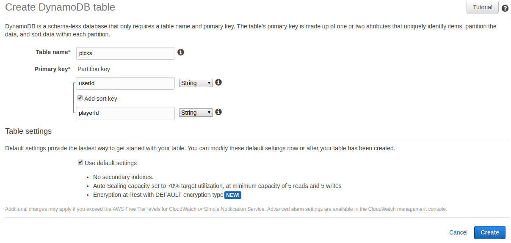
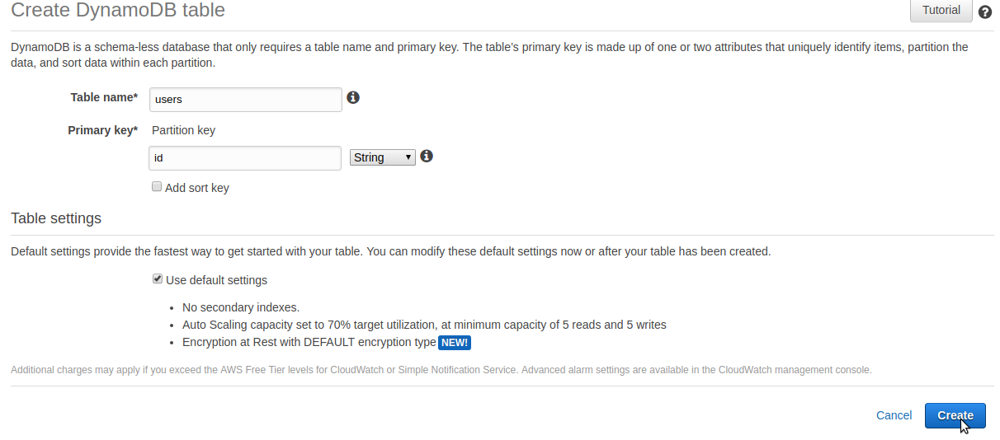
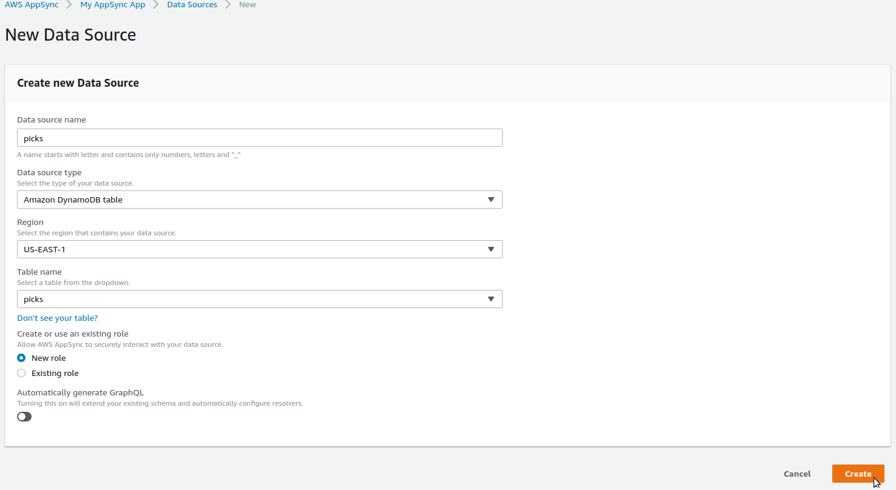
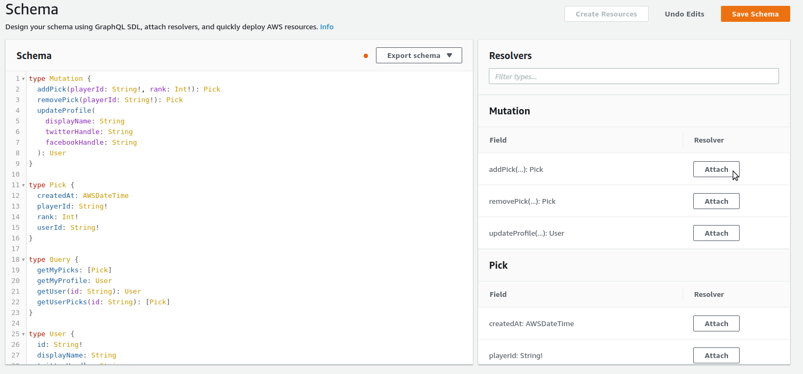
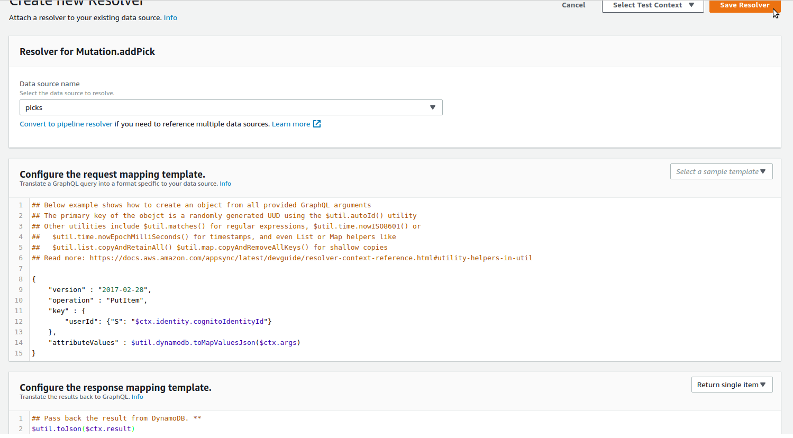

I present this not as "the right way," but merely the way I did it.

# Foreward

I set out to build a serverless application that would facilitate a game inspired by the Effectively Wild podcast's [episode #1315](https://blogs.fangraphs.com/effectively-wild-episode-1315-the-2019-minor-league-free-agent-draft/).

I envisioned a site where users could choose to login via facebook or via an email address and password. Also, there would be a leaderboard that would be visible to users who were not logged in.

This was a fun excuse for me to further my studies in the following technologies:

- ReactJS
- Aws Amplify
- Aws AppSync
- Aws Cloudfront
- Aws Cognito

# To launch this project

First set up your AWS environment. I may try to squeeze all of this into a Cloudformation Template at some point. But for now, here are the instructions.

## DynamoDB

- [Sign up for AWS](https://aws.amazon.com/Sign-Up‎)
- [Create two DynamoDB tables](https://console.aws.amazon.com/dynamodb/home?region=us-east-1)
  - picks
    
  - users
    

## AppSync

- [Create An AppSync API](https://console.aws.amazon.com/appsync/home?region=us-east-1#/create)
  - Choose "build from scratch"
  - Give your API a name
- Edit the settings
  - Click "Settings" on the left
  - Copy your API URL into a scratch document for later use
  - Change the Authorization Type to be "AWS Identity and Access Management (IAM)"
  - Click Save
- Add Data Sources
  - Click "Data Sources" on the left
  - Click "Create data source"
    
  - Do the same thing for your users table
- Edit the Schema

  - Click on "Schema" on the left
  - Paste [this file's](tutorial/appsync/schema.graphql) contents into the large "Schema" area and save it
  - Attach a resolver to the "addPick" mutation
    - Click Attach for the addPick mutation
      
    - Select the "picks" data source
    - Copy in the (request)[tutorial/appsync/resolvers/Mutation.addPick.request] and (response)[tutorial/appsync/resolvers/Mutation.addPick.response] to their respective inputs and click "Save Resolver"
      
  - Do the same thing for the following:
    - Mutations
      - removePick ([request](tutorial/appsync/resolvers/Mutation.removePick.request), [response](tutorial/appsync/resolvers/Mutation.removePick.response))
      - updateProfile ([request](tutorial/appsync/resolvers/Mutation.updateProfile.request), [response](tutorial/appsync/resolvers/Mutation.updateProfile.request))
    - Queries
      - getMyPicks ([request](tutorial/appsync/resolvers/Query.getMyPicks.request), [response](tutorial/appsync/resolvers/Query.getMyPicks.response))
      - getMyProfile ([request](tutorial/appsync/resolvers/Query.getMyProfile.request), [response](tutorial/appsync/resolvers/Query.getMyProfile.response))
      - getUser ([request](tutorial/appsync/resolvers/Query.getUser.request), [response](tutorial/appsync/resolvers/Query.getUser.response))
      - getUserPicks ([request](tutorial/appsync/resolvers/Query.getUserPicks.request), [response](tutorial/appsync/resolvers/Query.getUserPicks.response))

## Cognito

- Go to [Cognito](https://console.aws.amazon.com/cognito/home?region=us-east-1#)
- Create a new User Pool
  - Click on "Manage User Pools"
  - Click "Create User Pool"
  - Give your pool a name
  - Click "Review Defaults"
  - Click "Attributes" on the left to change its settings
    - Select "Email address or phone number" instead of "Username"
    - Click "Next Step" (this is what actually saves those changes)
  - In the "Policies" section, I unselected all of the password requirements. But that's up to you.
  - Click on "App clients"
    - Click on "Add an app client"
    - Give your new app client a name. I used "web"
    - Unselect the "Generate client secret" checkbox
    - Click "Create Client App"
  - Click "Review"
  - Click "Create pool"
  - Copy the Pool Id into a scratch document for later use

* `git clone https://github.com/murribu/milb-freeagent-draft`
* [Install and configure amplify](https://aws-amplify.github.io/docs/), if you haven't already.
* `amplify init`
* `amplify add hosting`
